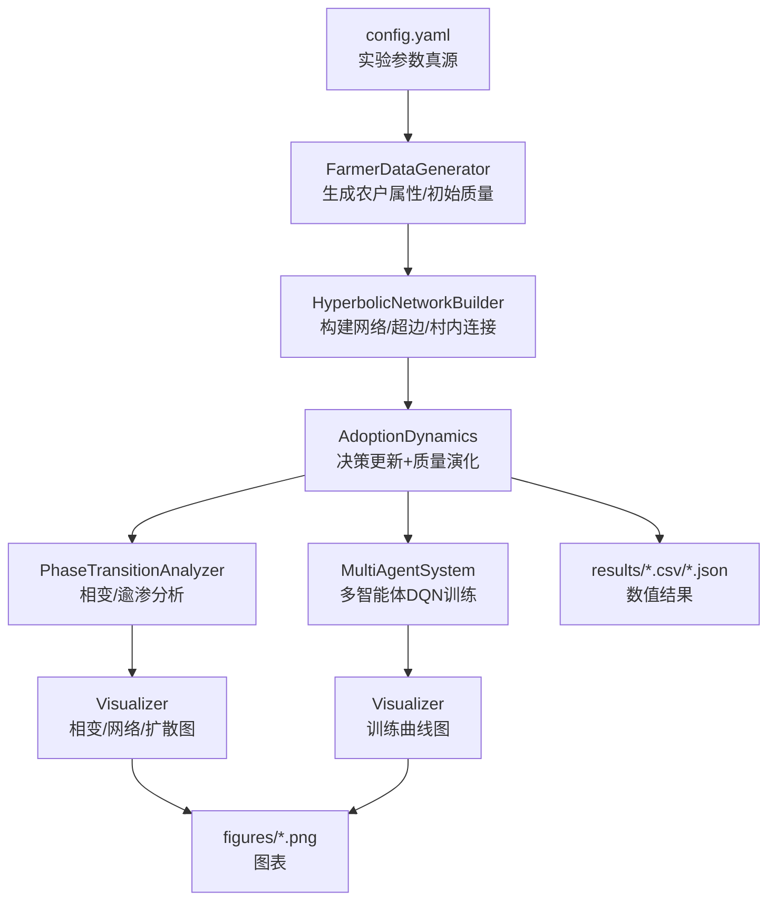

# 架构总览

## 1. 系统目标

本项目将**复杂网络（双曲几何无标度网络 + 超边）**、**行为决策（TPB + Logit/阈值）**与**多智能体强化学习（DQN）**整合到统一仿真框架中，用于研究农户绿色施肥采纳扩散、相变与政策工具作用。

## 2. 模块边界（src/）

- `src/data_generator.py`：生成农户异质属性与初始状态（含三维土壤质量）
- `src/network_builder.py`：构建网络（双曲距离连边 + 村内强连接 + 超边）
- `src/dynamics.py`：动力学演化（质量方程 + 决策机制 + 社会影响）
- `src/phase_transition.py`：相变/阈值分析（含巨型连通分量作为序参量）
- `src/rl_agent.py`：多智能体 DQN（状态/动作/奖励/训练与同步决策）
- `src/visualization.py`：图表输出
- `src/utils.py`：通用工具（I/O、统计、归一化、实验摘要/对比）

## 3. 数据流（从配置到产物）

## 4. 调用链（run_experiment.py）

入口为 `run_experiment.py`：

- `Experiment.run_baseline_simulation()`
  1) 生成农户数据
  2) 构建网络 + 超边 + 村内强连接
  3) 动力学仿真（Logit 决策）
  4) 相变扫描（阈值判据）+ Sigmoid 拟合 + 网络传播效应
  5) 生成可视化 + 保存 summary

- `Experiment.run_rl_training()`
  1) 初始化环境（网络/超边固定）
  2) 初始化多智能体系统（每个农户一个 DQN）
  3) 训练（固定 subsidy，episode 内多步）
  4) 保存模型/曲线

- `Experiment.run_comparative_analysis()`
  - 对比 baseline 与 RL 的采纳率与全局质量曲线。

## 5. 关键建模假设（代码事实）

- 农户属性为合成数据（分布由 `config.yaml` 控制，部分概率在代码中硬编码）
- 网络为合成网络（基于 3D 坐标近似双曲距离，连边概率指数衰减）
- 存在超边结构模拟合作社等群体影响
- 决策机制支持两种：
  - Logit 随机效用（`logit_adoption_probability`）
  - 阈值/逾渗式判据（`percolation_threshold_check`）
- 土壤质量为三维状态并通过加权得到综合质量 `land_quality` 与全局 `global_Q`
- RL 为多智能体 DQN：每个农户一个网络与经验池（非共享参数）。
