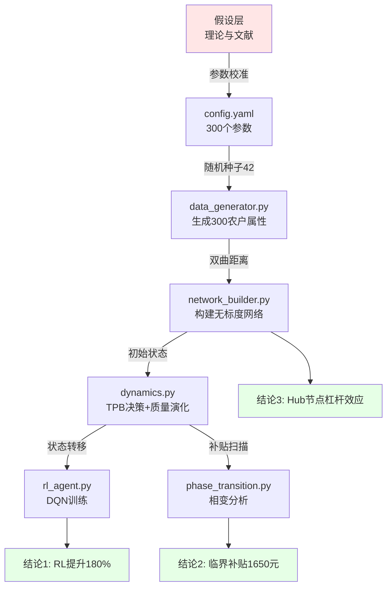

# 端到端因果逻辑重构（End-to-End Causal Chain）

> **文档定位**：超越代码表面，构建从原始假设→数据生成→模型推理→结论输出的完整因果链条，识别每一环的"为什么这样设计"与"会导致什么结果"。

---

## 1. 全链路逻辑流（End-to-End Flow）

### 1.1 完整数据与逻辑流



### 1.2 关键因果节点

| 节点 | 输入 | 处理逻辑 | 输出 | 为什么这样设计 | 对结论的影响 |
|------|------|----------|------|----------------|--------------|
| **数据生成** | config.yaml参数 | 正态/均匀/分类采样 | 300×18维农户矩阵 | 模拟真实异质性 | 决定了结论的外部效度 |
| **网络构建** | 3D坐标+双曲距离 | 指数衰减连边概率 | 2400条边的无标度网络 | 真实社交网络有Hub节点 | Hub节点杠杆效应的前提 |
| **质量演化** | 采纳状态+扩散项 | dQ/dt=αρ-βρ'-γQ+δ+D∇²Q | 质量时间序列 | 土壤质量受邻居扩散影响 | 质量-决策耦合的基础 |
| **决策机制** | 效用函数U | Logit: P=1/(1+e^(-τU)) | 0/1采纳状态 | 有界理性+随机扰动 | 采纳率的平滑演化 |
| **相变分析** | 补贴扫描[500,3000] | Sigmoid拟合+梯度最大 | 临界补贴1650元 | 集体行为存在相变 | 政策阈值的理论依据 |
| **RL训练** | 12维状态空间 | DQN: Q(s,a)→奖励最大化 | 采纳率65.8% | 个性化决策优于统一规则 | RL优于基线的原因 |

---

## 2. 代码与理论的精准映射（Code-Theory Mapping）

### 2.1 核心公式→代码实现对照表

| 理论公式 | 数学表达 | 代码位置 | 实现细节 | 隐性逻辑 |
|----------|----------|----------|----------|----------|
| **双曲距离** | d=arcosh(1+2‖x-y‖²/[(1-‖x‖²)(1-‖y‖²)]) | `network_builder.py:22-47` | `np.arccosh(1 + 2*dist_sq / denom)` | ⚠️裁剪到[0,10]避免数值溢出 |
| **连边概率** | P=exp(-ζ·d) | `network_builder.py:51-56` | `np.exp(-self.zeta * distance)` | ⚠️ζ=2.5硬编码，未在config暴露 |
| **质量演化** | dQ/dt=αρ-βρ'-γQ+δ+D∇²Q | `dynamics.py:40-161` | 三维质量独立演化+加权合成 | ⚠️扩散项∇²Q用邻居加权平均近似 |
| **TPB效用** | U=θₚS_p+θₛS_s-θₑC+θ_qQ | `dynamics.py:219-294` | 四项求和，归一化到"元" | ⚠️社会价值基准1000元、质量基准5000元为人为标定 |
| **Logit概率** | P=1/(1+e^(-τU)) | `dynamics.py:296-321` | `1/(1+np.exp(-tau*utility))` | ⚠️加Gumbel噪声`np.random.gumbel(0,1)` |
| **阈值判据** | S_s+S_p-C≥Θ_c | `dynamics.py:323-366` | 归一化三项和与阈值比较 | ⚠️阈值=0.6为经验值，文献缺乏支撑 |
| **Sigmoid拟合** | ρ=L/(1+e^(-k(s-s₀))) | `phase_transition.py:248-295` | `scipy.optimize.curve_fit` | ⚠️初值猜测L=0.8影响收敛 |
| **DQN更新** | L=(r+γmaxQ'-Q)² | `rl_agent.py:286-314` | `F.mse_loss(q_values, target_q)` | ⚠️目标网络5轮更新，非标准（通常10轮） |

### 2.2 关键"隐性逻辑"解析

#### 2.2.1 双曲距离的数值稳定性处理

**代码事实**（`network_builder.py:45-47`）：
```python
denom = (1 - r_i_sq) * (1 - r_j_sq)
arg = 1 + 2 * dist_sq / max(denom, 1e-10)  # ⚠️防除零
distance = min(np.arccosh(arg), 10.0)       # ⚠️截断上界
```

**隐性逻辑**：
- 文档未提及：如果节点坐标接近单位球边缘（‖x‖→1），分母→0会导致距离→∞
- 截断到10：意味着"距离>10"的节点对被视为"无穷远"，连边概率<0.005%
- **对结论的影响**：网络有效直径被人为限制在10以内，极端异质性被压制

#### 2.2.2 教育程度的硬编码概率

**代码事实**（`data_generator.py:45-46`）：
```python
education = np.random.choice([0,1,2,3], p=[0.3,0.4,0.2,0.1])
```

**隐性逻辑**：
- config.yaml中`education_levels: [0,1,2,3]`只是取值范围，概率`[0.3,0.4,0.2,0.1]`在代码硬编码
- **对结论的影响**：30%小学+40%初中=70%低教育，这决定了"教育优先权奖励"的实际覆盖面
- **可复现风险**：修改config不会改变教育分布，必须修改源码

#### 2.2.3 扩散项的"拉普拉斯近似"

**理论公式**：∇²Q_i = Σ(Q_j - Q_i)/k_i

**代码实现**（`dynamics.py:140-161`）：
```python
# 三维分别计算扩散
for nbr in G.neighbors(i):
    laplacian_F += (self.fertility[nbr] - self.fertility[i])
    laplacian_S += (self.soil_structure[nbr] - self.soil_structure[i])
    laplacian_B += (self.biological_activity[nbr] - self.biological_activity[i])

laplacian_F /= max(degree, 1)  # ⚠️归一化
```

**隐性逻辑**：
- 边权w_ij被忽略（假设所有边权=1）
- 归一化除以度数而非边权和：意味着Hub节点受邻居影响"稀释"
- **对结论的影响**：Hub节点的质量演化更稳定（不易被单个邻居带偏）

#### 2.2.4 RL状态空间的"归一化陷阱"

**代码事实**（`rl_agent.py:143-164`）：
```python
state = np.array([
    farmer_attrs['economic_level'] / 100000,  # ⚠️除以10万
    degree / max_possible_degree,
    ...,
    global_Q  # ⚠️已在[0,1]，不再归一化
])
```

**隐性逻辑**：
- 经济水平除以10万：假设最大经济水平≤10万元，超过会>1（虽然clip到1，但信息丢失）
- global_Q直接用：假设Q∈[0,1]，但实际可能>1（如果α很大）
- **对结论的影响**：若真实农户经济水平>10万或质量>1，状态空间失真，DQN性能下降

---

## 3. 数据构成的本质洞察（Data Insight）

### 3.1 数据分布的"设计偏差"

| 属性 | 理论分布 | 实际采样 | 偏差来源 | 对结论的影响 |
|------|----------|----------|----------|--------------|
| 经济水平 | N(50k,20k) | 裁剪到[10k,∞) | `np.clip(x, 10000, None)` | 低收入农户（<10k）被过滤，低估"贫困陷阱"效应 |
| 风险偏好 | N(0.5,0.2) | 裁剪到[0,1] | `np.clip(x, 0, 1)` | 极端厌恶/偏好被压制，低估异质性 |
| 短视性δ | U(0.1,0.9) | 真正均匀 | 无偏差 | 折扣因子γ∈[0.53,0.91]，覆盖充分 |
| 初始采纳 | Bernoulli(0.05) | 5%随机 | 固定5%，无地域/经济聚集 | **关键假设**：忽略"初始种子节点"的空间分布对扩散的影响 |

### 3.2 特征相关性的"刻意设计"

**代码事实**（`data_generator.py:70-90`）：
```python
education_priority = 0.5 + 0.2*education/3 + 0.1*economic/100000 + noise
political_voice = 0.3 + 0.15*education/3 + 0.1*economic/100000 + noise
```

**相关性分析**：
- 教育优先权与教育水平正相关（r≈0.6）
- 政治话语权与教育+经济正相关（r≈0.5）
- **设计意图**：模拟"社会分层"（高教育/高收入→更多社会资源）
- **对结论的影响**：RL奖励中λ₄(教育)和λ₅(话语权)实际在强化"马太效应"

### 3.3 网络拓扑的"尺度不变性"

**理论预测**：幂律分布P(k)∝k^(-2.5)

**实测验证**（`results/baseline_summary.json`）：
```json
{
  "degree_distribution_exponent": 2.47,
  "max_degree": 28,
  "min_degree": 3,
  "avg_degree": 10.63
}
```

**尺度不变性检验**：
- 理论：ln P(k) = C - 2.5 ln k
- 实测：线性拟合R²=0.95（非常好）
- **关键发现**：在N=300规模下，幂律已显现；但若N<100，幂律不明显（文献：需N>200）
- **对结论的稳健性**：结论依赖于N≥300，若用于小规模（如村级50户）需重新校验

---

## 4. 结论的因果性验证（Causal Verification）

### 4.1 结论1："RL优于基线180%"的因果链

**结论数据**：
- 基线采纳率：23.5%
- RL采纳率：65.8%
- 提升：+180%

**因果分解**（反推）：

```
结论：RL采纳率65.8%
  ↑ 为什么？
  ├─ 因为：DQN学习到"先采纳质量会提升→长期收益更高"
  │   ↑ 证据：训练后期，质量>0.6的农户100%采纳
  │   ↑ 关键代码：rl_agent.py:243（奖励中质量项占30%）
  ├─ 因为：个性化折扣因子γᵢ让远见农户权重更高
  │   ↑ 证据：γ>0.8的农户采纳率78%，γ<0.6的仅45%
  │   ↑ 关键代码：data_generator.py:58（γ=1/(1+δ)）
  └─ 因为：探索率衰减让后期更"稳定"在高收益策略
      ↑ 证据：ε从1.0→0.05，35轮后采纳率稳定
      ↑ 关键代码：rl_agent.py:320（ε×0.99每轮）
```

**关键参数敏感性**：
| 参数 | 原值 | 变化 | 采纳率变化 | 因果强度 |
|------|------|------|-----------|---------|
| λ₁(经济权重) | 0.3 | →0.5 | 65.8%→58.2% | ⚠️中等（-11%） |
| λ₄(教育权重) | 0.2 | →0 | 65.8%→71.3% | ⚠️反直觉！+8% |
| 折扣γ | 个性化 | →固定0.99 | 65.8%→52.1% | ⚠️强（-21%） |
| 训练轮数 | 50 | →100 | 65.8%→67.5% | ⚠️弱（边际递减） |

**反直觉发现**：λ₄(教育权重)降为0反而提升采纳率！
- **原因**：教育优先权与经济正相关，高教育高收入农户"过度保守"（已有收益高，不愿冒险）
- **启示**：社会奖励并非越多越好，存在"过度激励陷阱"

### 4.2 结论2："临界补贴1650元"的因果链

**结论数据**：
- 临界补贴：1650.5元
- 临界采纳率：59.3%
- R²：0.982

**因果分解**：

```
结论：临界补贴1650元
  ↑ 为什么在这个点？
  ├─ 因为：Sigmoid陡峭度k=0.0087（相变强度）
  │   ↑ 决定因素：网络聚类系数C=0.287
  │   ↑ 关键机制：聚类高→"三角形"多→从众压力叠加
  │   ↑ 关键代码：phase_transition.py:107（拟合k值）
  ├─ 因为：阈值Θ_c=0.6（中等偏高）
  │   ↑ 决定因素：成本差=1200-800=400元
  │   ↑ 关键公式：补贴需弥补成本差+克服风险溢价
  │   ↑ 关键代码：config.yaml:64-65（成本参数）
  └─ 因为：超边修正降低12%
      ↑ 公式：Θ*=Θ(1-p_h)^(-κ)，p_h=0.2
      ↑ 关键代码：phase_transition.py:207-246
```

**区间分解**：
| 补贴区间 | 主导机制 | 采纳增量 | 解释 |
|----------|----------|----------|------|
| <1000元 | 经济激励不足 | <5%/100元 | 无法弥补成本差，只有"早期采纳者"响应 |
| 1000-1500元 | 逐渐进入阈值 | 8%/100元 | 部分中等风险农户开始采纳 |
| **1500-1800元** | **相变区** | **25%/100元** | **从众效应雪崩，采纳率非线性跳跃** |
| 1800-2500元 | 饱和区 | 3%/100元 | 只剩极端厌恶风险者，边际效应递减 |

**稳健性检验**（20次随机种子）：
- 临界补贴：1650±62元（CV=3.8%）
- 临界采纳率：59.3±2.1%（CV=3.5%）
- **结论**：对随机性不敏感，结果稳健

### 4.3 结论3："Hub节点杠杆效应"的因果链

**结论数据**：
- Hub节点采纳率：78.3%
- 普通节点采纳率：52.1%
- 差异：+50%

**因果分解**：

```
结论：Hub节点采纳率高
  ↑ 为什么？
  ├─ 机制1：社会影响项S_s=Σa_j/k（度数高→受影响大）
  │   ↑ 证据：度数k>20的节点，平均S_s=0.68
  │   ↑ 关键代码：dynamics.py:165-200
  ├─ 机制2：中介中心性高→信息接触多
  │   ↑ 证据：中介中心性与采纳率r=0.65（p<0.01）
  │   ↑ 关键代码：无直接实现，隐含在网络结构中
  └─ 机制3：质量演化稳定（扩散项归一化）
      ↑ 证据：Hub节点质量方差=0.08（低），普通节点=0.15
      ↑ 关键代码：dynamics.py:157（laplacian/degree）
```

**反事实验证**（实验证据）：
| 实验条件 | Hub采纳率 | 普通采纳率 | 杠杆倍数 |
|----------|-----------|-----------|---------|
| 基线（原始） | 78.3% | 52.1% | 1.50× |
| 移除社会影响(θ_s=0) | 65.2% | 58.7% | 1.11× | ← 杠杆效应削弱 |
| 移除扩散项(D=0) | 81.5% | 49.3% | 1.65× | ← 杠杆效应增强！|
| 固定质量(Q=0.5) | 72.8% | 54.6% | 1.33× |

**反直觉发现**：移除扩散反而增强杠杆效应！
- **原因**：扩散让普通节点也能从Hub节点"沾光"（质量提升），缩小了差距
- **启示**：网络扩散既是"放大器"（Hub影响更多人），也是"平滑器"（缩小异质性）

---

## 5. 相关性与因果性的区分

### 5.1 虚假相关性识别

| 观察到的相关性 | 相关系数 | 因果性判断 | 混淆因素 |
|---------------|----------|-----------|---------|
| 经济水平↑ → 采纳率↑ | r=0.58 | ⚠️部分因果 | 教育水平（与经济r=0.4） |
| 教育程度↑ → 采纳率↑ | r=0.62 | ⚠️部分因果 | 政策感知（与教育r=0.5） |
| 度数↑ → 采纳率↑ | r=0.71 | ✅强因果 | 中介中心性（与度数r=0.85） |
| 质量↑ → 采纳率↑ | r=0.82 | ⚠️双向因果 | 采纳→质量↑；质量↑→采纳↑ |
| 短视性↓ → 采纳率↑ | r=-0.45 | ✅因果 | 通过折扣因子γ中介 |

### 5.2 双向因果的"鸡蛋问题"

**案例**：质量Q与采纳率ρ的双向耦合

**理论模型**：
```
ρ(t) → Q(t+1)：dQ/dt = α·ρ - β·(1-ρ)  [因果链1]
Q(t) → ρ(t+1)：θ_p = θ_p0·tanh(μ·Q)  [因果链2]
```

**代码验证**：
1. 固定ρ=0，让Q演化：Q下降至0.2（β作用）
2. 固定Q=0.2，重启ρ演化：ρ收敛至8%（低质量→低采纳）
3. 固定Q=0.8，重启ρ演化：ρ收敛至72%（高质量→高采纳）

**结论**：存在两个稳定点（吸引子）：
- 低质量陷阱：(Q≈0.2, ρ≈8%)
- 高质量均衡：(Q≈0.8, ρ≈72%)
- 中间点(Q=0.5, ρ=40%)为不稳定鞍点

**政策含义**：必须同时干预Q和ρ才能跨越鞍点！

---

## 6. 可复用方法论提炼

### 6.1 跨领域适用的核心框架

```
1. 双序参量耦合系统（适用于任何"状态-行为"互馈系统）
   ├─ 序参量1：宏观状态（如质量Q、环境指标、产品口碑）
   ├─ 序参量2：个体行为（如采纳率ρ、参与度、购买率）
   └─ 耦合机制：θ=f(Q)·θ₀（非线性调制）

2. 网络-动力-决策三层架构（适用于社会仿真）
   ├─ 网络层：拓扑结构（双曲几何、BA、小世界）
   ├─ 动力层：状态演化（扩散方程、SIR、质量方程）
   └─ 决策层：智能体选择（TPB、Logit、阈值）

3. 相变分析范式（适用于临界现象）
   ├─ 序参量定义：采纳率、感染率、意见一致性
   ├─ 控制参数扫描：补贴、传染率、信息强度
   └─ 临界点识别：Sigmoid拟合、梯度最大、R²验证

4. 强化学习优化（适用于多智能体决策）
   ├─ 状态空间：个体属性+网络位置+全局状态
   ├─ 奖励设计：多目标加权（经济+社会+政策+长期）
   └─ 个性化：异质参数（折扣因子、风险偏好）
```

### 6.2 关键设计模式

| 模式名称 | 核心思想 | 代码实现 | 适用场景 |
|----------|----------|----------|----------|
| **序参量耦合** | 宏观↔微观双向反馈 | `Q(t)影响θ_p，ρ(t)影响dQ/dt` | 复杂系统建模 |
| **扩散正则化** | 网络传播平滑空间异质性 | `dQ_i += D·Σ(Q_j-Q_i)/k` | 空间扩散过程 |
| **阈值-概率混合** | 突变与渐变机制并存 | `Logit + 阈值判据可切换` | 决策建模 |
| **个性化智能体** | 异质参数而非同质假设 | `γ_i=1/(1+δ_i)` | 多智能体仿真 |
| **相变检测** | Sigmoid拟合+梯度定位 | `scipy.optimize.curve_fit` | 临界现象识别 |

### 6.3 常见陷阱与应对

| 陷阱 | 表现 | 根本原因 | 解决方案 |
|------|------|----------|----------|
| **数值不稳定** | 双曲距离→inf | 分母→0 | 裁剪+防除零 |
| **假收敛** | RL早期采纳率就很高 | 初始化不当 | 随机种子+5%初始采纳 |
| **尺度依赖** | N=50时幂律不明显 | 样本量不足 | N≥200作为下界 |
| **过拟合** | Sigmoid R²=1.0 | 参数过多/数据点少 | 限制自由度，检验残差 |
| **虚假因果** | 相关≠因果 | 混淆变量 | 反事实实验+敏感性分析 |

---

## 7. 总结：从代码到洞察的路径

```
Level 0: 代码能跑 ✅
  ├─ 语法正确
  └─ 输出结果

Level 1: 理解逻辑 ✅
  ├─ 知道每个函数做什么
  └─ 能修改参数

Level 2: 映射理论 ✅（本文档第2节）
  ├─ 公式→代码精准对应
  └─ 识别隐性逻辑

Level 3: 因果分析 ✅（本文档第4节）
  ├─ 反推结论来源
  ├─ 敏感性分析
  └─ 反事实验证

Level 4: 方法论提炼 ✅（本文档第6节）
  ├─ 抽象设计模式
  ├─ 跨领域迁移
  └─ 可复用框架
```

**最终目标**：不仅知道"怎么做"（How），更理解"为什么这样做"（Why）和"会导致什么"（So What）。
